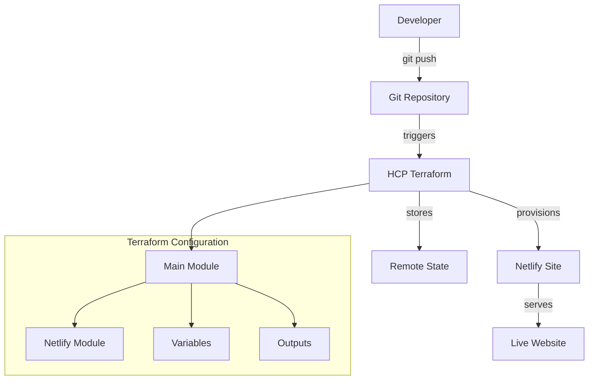
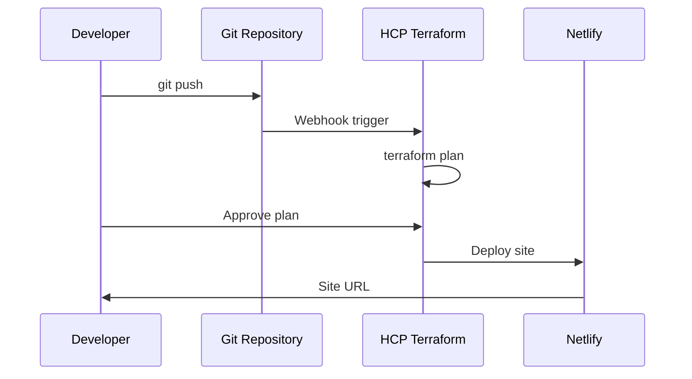

# Paradigm Shift - Netlify + HCP Terraform Deployment

[](https://www.terraform.io/)
[](https://www.netlify.com/)
[](https://cloud.hashicorp.com/)

> **A modern, responsive portfolio website deployed to Netlify using Terraform with HCP (HashiCorp Cloud Platform) remote state management.**
### 📖 Blog Post: Technical Deep Dive
**[Building a Modern Web Deployment Pipeline: Netlify + HCP Terraform + Team Collaboration](https://my-netlify-website.hashnode.dev/building-a-modern-web-deployment-pipeline-netlify-hcp-terraform-team-collaboration)**

##  Live Demo

**🔗 [View Live Site](https://paradigm-shift-z2mnjj5n.netlify.app)**

---

## Table of Contents

- [Overview](#-overview)
- [Architecture](#-architecture)
- [Features](#-features)
- [Prerequisites](#-prerequisites)
- [Quick Start](#-quick-start)
- [Project Structure](#-project-structure)
- [Configuration](#-configuration)
- [Deployment](#-deployment)
- [Variables](#-variables)
- [Outputs](#-outputs)
- [Troubleshooting](#-troubleshooting)
- [License](#-license)

---

##  Overview

**Paradigm Shift** is a modern, responsive portfolio website that demonstrates the power of Infrastructure as Code (IaC) using Terraform. This project showcases:

- **Automated deployment** of static websites to Netlify
- **Remote state management** using HCP Terraform (Terraform Cloud)
- **Modular architecture** with reusable Terraform components
- **Security best practices** with secret management
- **Professional workflow** suitable for team collaboration

### What Makes This Project Unique

 - **HTML5UP Template Integration**: Built on the beautiful "Paradigm Shift" template  
 - **Random Site Naming**: Automatic generation of unique site identifiers  
 - **Modular Design**: Clean separation of concerns with Terraform modules  
 - **Secure by Default**: All secrets managed through HCP Terraform variables  
 - **One-Click Deployment**: Simple `git push` triggers automatic deployments  
 - **Mobile Responsive**: Fully responsive design that works on all devices

---

##  Architecture



### Technology Stack

| Component | Technology | Purpose |
|-----------|------------|---------|
| **IaC** | Terraform | Infrastructure provisioning |
| **State Backend** | HCP Terraform | Remote state management |
| **Hosting** | Netlify | Static site hosting |
| **Frontend** | HTML5/CSS3/JS | Website content |
| **Version Control** | Git | Source code management |

---

##  Features

###  Infrastructure Features
- [x] **HCP Terraform Integration** - Remote state with team collaboration
- [x] **Modular Architecture** - Reusable Terraform components
- [x] **Variable-driven Configuration** - Easy customization
- [x] **Automatic Random Naming** - Prevents naming conflicts
- [x] **Comprehensive Outputs** - All important URLs and identifiers

###  Website Features
- [x] **Responsive Design** - Works on desktop, tablet, and mobile
- [x] **Modern UI/UX** - Clean, professional appearance
- [x] **Fast Loading** - Optimized assets and CDN delivery

---

##  Prerequisites

Before you begin, ensure you have the following:

### Required Accounts
1. **[Netlify Account](https://www.netlify.com/)** (Free tier sufficient)
2. **[HCP Terraform Account](https://cloud.hashicorp.com/)** (Free tier sufficient)
3. **[GitHub Account](https://github.com/)** (For version control)

### Required Software
| Software | Version | Installation |
|----------|---------|-------------|
| **Terraform** | `>= 1.0` | [Download](https://www.terraform.io/downloads) |
| **Git** | `>= 2.0` | [Download](https://git-scm.com/downloads) |
| **Node.js** | `>= 14` (Optional) | [Download](https://nodejs.org/) |

### Verify Installation
```bash
terraform --version  # Should show v1.0 or higher
git --version        # Should show v2.0 or higher
```

---

##  Quick Start

### 1. Clone the Repository
```bash
git clone https://github.com/Nifesimi-p/my-netlify-website.git
cd my-netlify-website
```

### 2. Set Up HCP Terraform

#### Create Organization & Workspace
1. Log into [HCP Terraform](https://app.terraform.io/)
2. Create a new organization (or use existing)
3. Create a new workspace:
   - **Type**: Version control workflow
   - **Repository**: Your forked repository
   - **Working Directory**: `environments`

#### Configure Workspace Settings
In your HCP Terraform workspace:

**Variables Tab → Terraform Variables:**
| Variable | Value | Sensitive |
|----------|-------|-----------|
| `site_name` | `Paradigm-shift` | No |
| `site_directory` | `./site` | No |
| `deploy_message` | `Deployed via Terraform` | No |
| `custom_domain` | *(leave empty)* | No |

**Variables Tab → Environment Variables:**
| Variable | Value | Sensitive |
|----------|-------|-----------|
| `TF_VAR_netlify_token` | `your-netlify-token` | **Yes** |

### 3. Get Netlify Token
1. Go to [Netlify User Settings](https://app.netlify.com/user/applications#personal-access-tokens)
2. Click **"New access token"**
3. Give it a name: `Terraform Deployment`
4. Copy the token and add it to HCP Terraform as shown above

### 4. Configure Backend
Update `environments/backend.tf` with your HCP details:

```hcl
terraform {
  cloud {
    organization = "your-organization-name"
    workspaces {
      name = "your-workspace-name"
    }
  }
}
```

### 5. Deploy
```bash
cd environments
terraform init    # Initialize Terraform
terraform plan    # Review planned changes
terraform apply   # Deploy infrastructure
```

**Or with HCP Terraform (Recommended):**
1. Push your changes to GitHub
2. HCP Terraform automatically triggers deployment
3. Review and approve the plan in the web UI

---

## Project Structure

```
my-netlify-website/
├── environments/              # Main Terraform configuration
│   ├── backend.tf            # HCP Terraform backend configuration
│   ├── main.tf              # Root module configuration
│   ├── variables.tf         # Input variables
│   ├── outputs.tf           # Output values
│   ├── providers.tf         # Provider configurations
│   ├── versions.tf          # Provider version constraints
│   ├── terraform.tfvars     # Variable values (excluded from Git)
│   └── modules/             # Local modules
│       └── netlify_site/    # Netlify site module
│           ├── main.tf      # Module resources
│           ├── variables.tf # Module variables
│           └── outputs.tf   # Module outputs
│   └── site/               # Website source files
│       ├── index.html      # Main HTML file
│       ├── assets/         # CSS, JS, fonts
│       └── images/         # Image assets
├── .gitignore              # Git ignore rules
├── README.md               # This file
└── LICENSE                 # Project license
```

### Key Files Explained

| File | Purpose |
|------|---------|
| `backend.tf` | Configures HCP Terraform as remote backend |
| `main.tf` | Calls the Netlify module with configuration |
| `variables.tf` | Defines all configurable parameters |
| `outputs.tf` | Exposes important values after deployment |
| `modules/netlify_site/` | Reusable module for Netlify site creation |

---

## Configuration

### Backend Configuration
The `backend.tf` file connects your local Terraform to HCP:

```hcl
terraform {
  cloud {
    organization = "your-hcp-org"
    workspaces {
      name = "netlify-site"
    }
  }
}
```

### Provider Configuration
The `providers.tf` file specifies required providers:

```hcl
terraform {
  required_providers {
    netlify = {
      source  = "netlify/netlify"
      version = "~> 0.4"
    }
    random = {
      source  = "hashicorp/random"
      version = "~> 3.0"
    }
  }
}

provider "netlify" {
  token = var.netlify_token
}
```

---

##  Deployment

### Local Deployment (Development)
```bash
# Initialize Terraform
terraform init

# Plan deployment (see what will be created)
terraform plan

# Apply changes
terraform apply

# View outputs
terraform output
```

### HCP Terraform Deployment (Production)
1. **Push to Git**: Commit and push your changes
   ```bash
   git add .
   git commit -m "Update site configuration"
   git push origin main
   ```

2. **Monitor HCP**: Watch the deployment in HCP Terraform web UI

3. **Review & Apply**: Approve the plan if everything looks correct

### Continuous Deployment Workflow


---

##  Variables

### Root Module Variables

| Variable | Type | Default | Description |
|----------|------|---------|-------------|
| `netlify_token` | `string` | *required* | Netlify Personal Access Token |
| `site_name` | `string` | *required* | Base name for the Netlify site |
| `site_description` | `string` | `""` | Description for the site |
| `site_directory` | `string` | `"./site"` | Path to website source files |
| `custom_domain` | `string` | `""` | Custom domain (optional) |
| `deploy_message` | `string` | `"Deployed via Terraform"` | Deployment message |

### Module Variables

The `netlify_site` module accepts the same variables as the root module, enabling reusability across different environments.

### Variable Validation

```hcl
variable "site_name" {
  description = "Name for the Netlify site"
  type        = string
  
  validation {
    condition     = length(var.site_name) > 0
    error_message = "Site name cannot be empty."
  }
}
```

---

## Outputs

### Available Outputs

| Output | Description | Example |
|--------|-------------|---------|
| `site_url` | Primary site URL | `https://paradigm-shift-abc123.netlify.app` |
| `site_name` | Full site name with suffix | `paradigm-shift-abc123` |
| `site_id` | Netlify site ID | `abc123def456` |
| `deployment_url` | Deployment-specific URL | `https://paradigm-shift-abc123.netlify.app` |
| `random_suffix` | Generated random suffix | `abc123` |
| `custom_domain` | Custom domain if set | `""` or `yourdomain.com` |

### Using Outputs

```bash
# View all outputs
terraform output

# Get specific output
terraform output site_url

# Use in other configurations
terraform output -json site_url
```
---

##  Troubleshooting

### Common Issues

#### ❌ "No value for required variable" Error
**Problem**: Variable not set in HCP Terraform workspace

**Solution**:
1. Go to HCP Terraform workspace
2. Navigate to Variables tab
3. Add missing variables as shown in [Quick Start](#-quick-start)

#### ❌ "Site not found" (404 Error)
**Problem**: Site directory is empty or path is incorrect

**Solution**:
```bash
# Check if site files exist
ls -la ./site/

# Verify index.html exists
cat ./site/index.html

# Update site_directory variable if needed
```

#### ❌ "Failed to install provider" Error
**Problem**: Network issues or incorrect provider source

**Solution**:
1. Check internet connection
2. Verify provider source in `versions.tf`:
   ```hcl
   netlify = {
     source  = "netlify/netlify"  # Use official provider
     version = "~> 0.4"
   }
   ```

#### ❌ "Apply not allowed for workspaces with VCS connection"
**Problem**: Trying to run `terraform apply` locally with HCP workspace

**Solution**:
Use the VCS-driven workflow:
```bash
git add .
git commit -m "Your changes"
git push origin main
# Then approve in HCP Terraform web UI
```

### Debug Commands

```bash
# Check Terraform version
terraform version

# Validate configuration
terraform validate

# Format code
terraform fmt -recursive

# Check workspace connection
terraform login

# Show current state
terraform show

# List all resources
terraform state list
```

### Getting Help

- **Terraform Documentation**: [terraform.io/docs](https://terraform.io/docs)
- **Netlify Provider**: [registry.terraform.io/providers/netlify/netlify](https://registry.terraform.io/providers/netlify/netlify)
- **HCP Terraform**: [cloud.hashicorp.com/docs](https://cloud.hashicorp.com/docs)
- **Community**: [discuss.hashicorp.com](https://discuss.hashicorp.com)

---

## Security Best Practices

###  Implemented Security Measures

1. **Secrets Management**: All sensitive data stored in HCP Terraform
2. **Git Security**: `.gitignore` excludes terraform.tfvars and state files
3. **Token Scoping**: Netlify token has minimal required permissions
4. **Variable Encryption**: HCP Terraform encrypts sensitive variables
5. **Access Control**: HCP workspaces support RBAC

---

## HUG Ibadan Challenge

This project was created for the **HUG (HashiCorp User Group) Ibadan** Terraform Challenge. 

### Challenge Requirements Met 
- [x] Deploy static site on Netlify using Terraform
- [x] Configure HCP Terraform as remote backend
- [x] Make the site unique with custom design
- [x] Document setup clearly for easy replication
- [x] Keep all secrets out of repository
- [x] Include comprehensive outputs
- [x] Use modular architecture

### What Makes This Project Special
 - **Creative Design**: Modern, responsive portfolio template  
 - **Professional Setup**: Production-ready configuration  
 - **Comprehensive Docs**: Detailed setup and troubleshooting guides  
 - **Easy Deployment**: One-push deployment workflow  
 - **Security First**: Best practices implemented throughout  

---

##  Featured Content

### 📖 Blog Post: Technical Deep Dive
**[Building a Modern Web Deployment Pipeline: Netlify + HCP Terraform + Team Collaboration](https://my-netlify-website.hashnode.dev/building-a-modern-web-deployment-pipeline-netlify-hcp-terraform-team-collaboration)**

*Discover the technical architecture, integration challenges, and team collaboration strategies behind this project. Written for the HUG Ibadan Terraform Challenge.*

###  Live Demo
**[View Live Site](https://paradigm-shift-z2mnjj5n.netlify.app)**

##  License

This project is licensed under the MIT License - see the [LICENSE](LICENSE) file for details.

---

##  Acknowledgments

- **[HUG Ibadan](https://www.linkedin.com/company/hug-ibadan/)** for organizing the Terraform Challenge
- **[HTML5UP](https://html5up.net/)** for the beautiful "Paradigm Shift" template
- **[HashiCorp](https://www.hashicorp.com/)** for Terraform and HCP Terraform
- **[Netlify](https://www.netlify.com/)** for excellent static site hosting
- **Community Contributors** who helped improve this project

---


[](https://github.com/yourusername/paradigm-shift-terraform)
[](https://github.com/yourusername/paradigm-shift-terraform/fork)


</div># my-netlify-website
